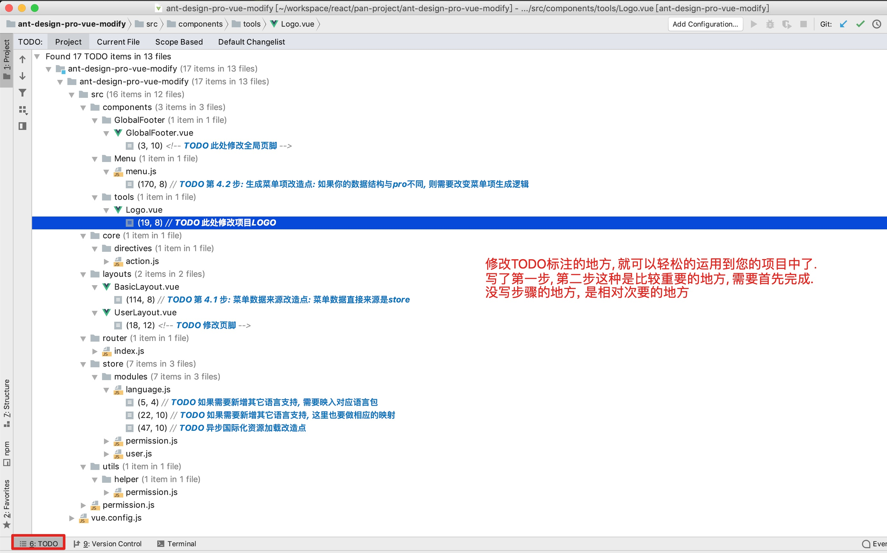

<h1 align="center">Ant Design Pro Vue Modify</h1>
<div align="center">
本项目是一个面向中后台的前框框架(支持PC和移动端). 是在Ant Design Pro Vue项目的基础上修改而来
</div>

## 在线实例

http://free_pan.gitee.io/ant-design-pro-vue-modify/

有两个账号: 

超管: admin/admin
普通: test/test

## 修改点

* 加入国际化支持
* 加入动态菜单支持

### 修改点说明

#### 关于国际化支持

原pro有一个i18n的分支, 主要是没有相关的文档说明, 以及未与最新master版本同步, 因此自己写了一个

#### 关于动态菜单

原pro有一个动态菜单的分支, 主要问题是, 那个菜单的构建, 是根据路由数据来的, 形成了强耦合, 个人认为菜单数据不应该与路由数据强耦合.

## 版本对应关系

| 原pro | 当前项目 | 同步/发布时间 |
| --- | --- | --- |
| master | master | 2019-08-11 |
| 2.0.2 | 2.0.2 | 2019-08-11 |

## 您可能会有的疑问

<font color='orange'>**为什么登录和获取用户权限信息要分成两次请求?**</font>

登录: 主要作用是为了验证登录凭证是否正确

获取权限信息: 是为了获取前端构建动态菜单, 动态路由以及鉴权的数据

_这里着重说明_: 动态菜单和动态路由是两个不同的概念.

动态菜单: 是指你登录成功之后, 看到的左侧的主菜单, 只是数据从后端获取, 前端动态构建

动态路由: 粗略的讲就是是指你的url地址与组件的映射关系. 本项目会根据菜单唯一标识, 去动态构建这个路由映射. 好处是能够达到`前端界面可见性的强控制`. 


如果你只有动态菜单, 而没有动态路由, 那么你只做到了菜单的可见不可见控制, 如果直接使用url地址访问, 一个不可见菜单的界面, 依然能够加载出这个界面. 而如果有了动态路由的加入, 此时你再使用这个这个url地址访问, 显示的就是404页面


<font color='orange'>**构建动态路由为什么使用flag值与路由表的permission属性比较, 而不是路由的name比较?**</font>

首先路由的`name`属性有个特点就是必须唯一,而菜单的`flag`值也是唯一. 我们做如:`商品管理`的时候, 商品的属性可能非常多, 新增或编辑时, 只能使用路由方式打开一个新界面, 而非使用弹窗形式. 而做动态路由的目的是为了, 达到界面本身的可见性或可访问性的强控制. 此时如果, 我未授予某个用户`商品管理`的菜单, 我期望的效果是, 从`商品列表界面`, `商品新增界面`, `商品编辑界面` 这些和商品管理相关的界面, 该用户都不能访问, 也就是说菜单`flag`要与多个路由关联(即:一对多关系), 因此, `name` 就不合适了, 必须是`permission`. 但这里不是说, 子路由的`permission`一定要和父路由的一致, 而是说, 有这种需求时, 可以采用这种配置方式, 达到不授予某一个菜单时, 做到禁止用户访问访问多个界面的目的.

## 菜单数据结构

| 属性名 | 类型 | 是否允许为空 | 其它说明 |
| --- | --- | --- | --- |
| path | string | 否 | 点击后的跳转路径. 即使是没有对应界面的菜单项也必须有path值. 如果path值以 `http://` 或 `https://` 打头, 则在新标签页打开, 否则在当前页打开 |
| flag | string | 否 | 唯一, 构建菜单时不需要, 但需要使用该属性与路由中的permission值进行比较,用于构建动态路由 |
| title | string | 否 | 菜单标题 |
| icon | string | 是 | 菜单图标 |
| children | array<object> | 是 | 子菜单 |

## 如何应用到自己的项目

项目源文件中有使用TODO方式标注修改点, 您只需要按照修改点进行相应修改即可.

标明了步骤顺序的TODO是比较重要的, 应该优先完成修改



环境和依赖
----

- node
- yarn
- webpack
- eslint
- @vue/cli ~3
- [ant-design-vue](https://github.com/vueComponent/ant-design-vue) - Ant Design Of Vue 实现
- [vue-cropper](https://github.com/xyxiao001/vue-cropper) - 头像裁剪组件
- [@antv/g2](https://antv.alipay.com/zh-cn/index.html) - Alipay AntV 数据可视化图表
- [Viser-vue](https://viserjs.github.io/docs.html#/viser/guide/installation)  - antv/g2 封装实现
- [vue-i18n](https://kazupon.github.io/vue-i18n/zh/)  - 国际化插件

> 请注意，我们强烈建议本项目使用 [Yarn](https://yarnpkg.com/) 包管理工具，这样可以与本项目演示站所加载完全相同的依赖版本 (yarn.lock) 。由于我们没有对依赖进行强制的版本控制，采用非 yarn 包管理进行引入时，可能由于 Pro 所依赖的库已经升级版本而引入了新版本所导致的问题。作者可能会由于时间问题无法及时排查而导致您采用本项目作为基项目而出现问题。


项目下载和运行
----

- 拉取项目代码
```bash
git clone https://gitee.com/free_pan/Ant-Design-Pro-Vue-Extends.git
cd Ant-Design-Pro-Vue-Extends
```

- 安装依赖
```
yarn install
```

- 开发模式运行
```
yarn run serve
```

- 编译项目
```
yarn run build
```

- Lints and fixes files
```
yarn run lint
```


其他说明
----

- 项目使用的 [vue-cli3](https://cli.vuejs.org/guide/), 请确保你所使用的 vue-cli 是新版，并且已经学习 cli 官方文档使用教程

- 关闭 Eslint (不推荐) 移除 `package.json` 中 `eslintConfig` 整个节点代码, `vue.config.js` 下的 `lintOnSave` 值改为 `false`

- 开启组件按需加载 `/src/main.js` L14 修改为 `import './core/lazy_use'`

- [修改 Ant Design 配色](https://github.com/kokoroli/antd-awesome/blob/master/docs/Ant_Design_%E6%A0%B7%E5%BC%8F%E8%A6%86%E7%9B%96.md)
- **使用polyfill兼容至 IE10**

## 浏览器兼容

Modern browsers and IE10.

| [](http://godban.github.io/browsers-support-badges/)</br>IE / Edge | [](http://godban.github.io/browsers-support-badges/)</br>Firefox | [](http://godban.github.io/browsers-support-badges/)</br>Chrome | [](http://godban.github.io/browsers-support-badges/)</br>Safari | [](http://godban.github.io/browsers-support-badges/)</br>Opera |
| --- | --- | --- | --- | --- |
| IE10, Edge | last 2 versions | last 2 versions | last 2 versions | last 2 versions |
